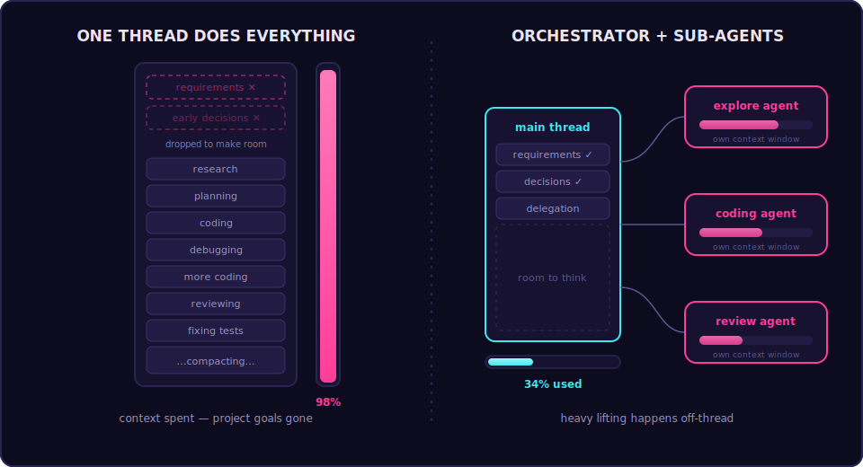
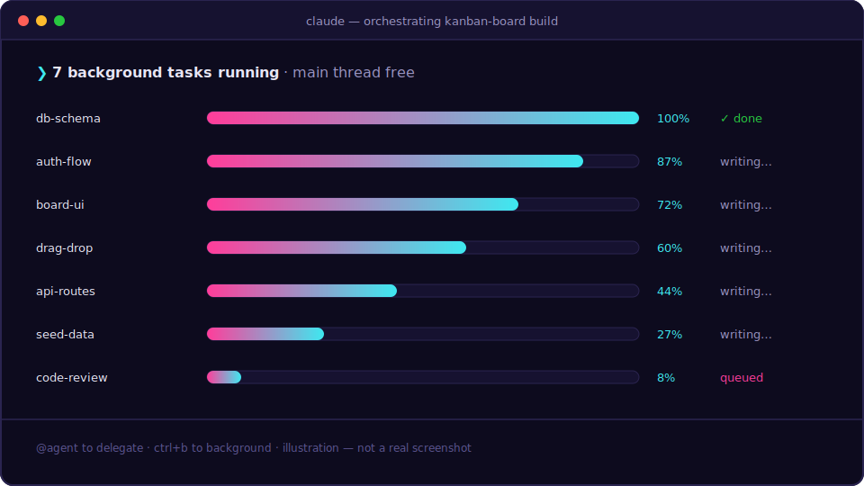
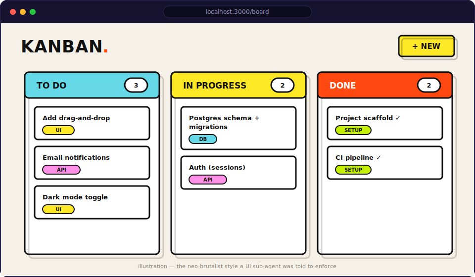

For many developers, "vibe coding" with AI starts as a magic trick but often hits a wall as projects grow in complexity. You might find your agent becoming forgetful, hallucinating, or "compacting" the conversation just when things get critical. The secret to moving beyond basic snippets to building full-scale applications is mastering sub-agents and background workflows.

## The context window crisis

The most significant hurdle in agentic coding is the context window. When you use a single main agent for everything — researching, planning, coding, and reviewing — you quickly consume the available tokens (often around 200,000). Once you exceed this limit, the model drops early messages to make room for new ones, causing it to lose sight of your project's core requirements.

## The solution: specialized sub-agents

Instead of forcing one agent to be a "jack of all trades," Claude Code allows you to invoke specialized sub-agents. These sub-agents operate in their own threads with their own context windows, effectively protecting the main thread from bloat.

Claude comes with several built-in specialists:

- **Bash agent** — a specialist for terminal tasks and git operations.
- **Explore agent** — uses a fast, cheap model to quickly map out codebases.
- **Planning agent** — investigates requirements and helps draft technical solutions.

You can even create your own custom agents at a project or personal level. For instance, you can define a "UI expert" with specific neo-brutalism design rules, or a "code reviewer" that enforces modularity and security.

## Mastering parallel workflows

One of the most powerful features of sub-agents is the ability to run them in parallel. Rather than waiting for an agent to finish a long task, you can trigger a sub-agent with the `@` symbol and press `Ctrl+B` to move that task to the background. This frees up the main agent so you can continue your conversation while the specialized work happens asynchronously.

For complex features, such as building a full-stack Kanban board, you can instruct the main agent to act purely as an orchestrator. In this workflow:

1. **Planning sub-agents** draft the technical spec.
2. **Coding sub-agents** implement different "tracks" or features in parallel (e.g., one for the database, one for the UI).
3. **Reviewer sub-agents** check the work against your quality standards before it's merged.

## The quality difference

While it might seem like extra overhead, the results are night and day. Because each sub-agent has a specific, narrow scope, they produce higher-quality code than a single agent trying to juggle the entire project's state. In one demonstration, a complex app with authentication and a Postgres database was completed while only using 68% of the main context window — a feat impossible in a single-thread conversation.

By offloading heavy lifting to background specialists, you ensure your main conversation remains clean, focused, and — most importantly — intelligent enough to see the project through to the finish line.
